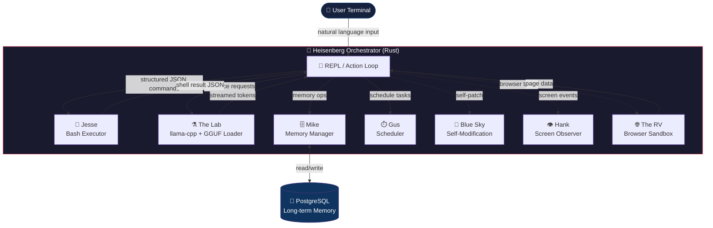
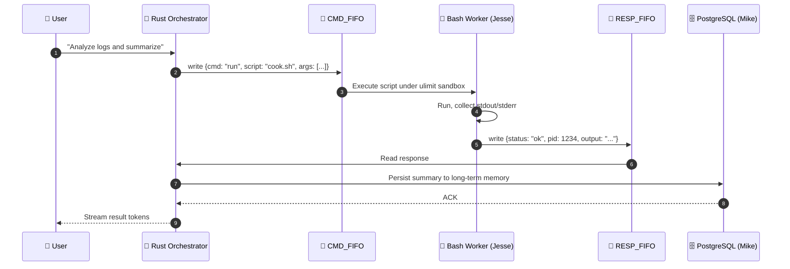
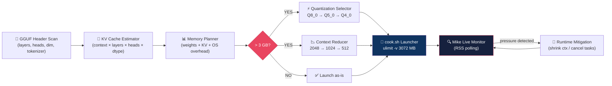
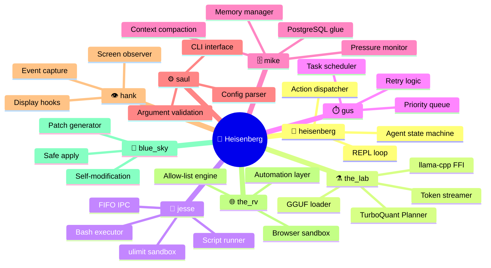

<div align="center">

```
██╗  ██╗███████╗██╗███████╗███████╗███╗   ██╗██████╗ ███████╗██████╗  ██████╗
██║  ██║██╔════╝██║██╔════╝██╔════╝████╗  ██║██╔══██╗██╔════╝██╔══██╗██╔════╝
███████║█████╗  ██║███████╗█████╗  ██╔██╗ ██║██████╔╝█████╗  ██████╔╝██║  ███╗
██╔══██║██╔══╝  ██║╚════██║██╔══╝  ██║╚██╗██║██╔══██╗██╔══╝  ██╔══██╗██║   ██║
██║  ██║███████╗██║███████║███████╗██║ ╚████║██████╔╝███████╗██║  ██║╚██████╔╝
╚═╝  ╚═╝╚══════╝╚═╝╚══════╝╚══════╝╚═╝  ╚═══╝╚═════╝ ╚══════╝╚═╝  ╚═╝ ╚═════╝
```

### *"I am the one who knocks."*

<br/>

[](https://github.com/at264939-ctrl/Heisenberg/stargazers)
[](https://github.com/at264939-ctrl/Heisenberg/network/members)
[](LICENSE)
[](https://www.rust-lang.org/)
[](https://github.com/at264939-ctrl/Heisenberg)
[](https://github.com/at264939-ctrl/Heisenberg)
[](https://github.com/at264939-ctrl/Heisenberg)
[](https://github.com/at264939-ctrl/Heisenberg)

<br/>

> **A fully local, production-grade autonomous AI agent.**
> Runs 9B-class GGUF models on constrained hardware using adaptive **TurboQuant** strategies —
> all within a strict **3 GB RAM budget**, no cloud required.

<br/>

[🚀 Quick Start](#-quick-start) · [🏗️ Architecture](#️-system-architecture) · [🧠 TurboQuant](#-turboQuant-engine) · [📁 Structure](#-project-structure) · [🔒 Security](#-security--privacy) · [☕ Support](#-support-me)

</div>

---

## 🌟 What Is Heisenberg?

**Heisenberg** is not just another AI wrapper. It is a **production-oriented autonomous agent** built from the ground up for developers who refuse to compromise on privacy, performance, or control.

| Feature | Detail |
|---|---|
| 🧱 **Core Language** | Rust — zero-cost abstractions, memory safety, raw speed |
| 🤖 **Inference Engine** | llama-cpp via FFI/subprocess (GGUF native) |
| 💾 **Memory Model** | Adaptive 3 GB hard cap with graceful degradation |
| 🐚 **Execution Layer** | Bash-first, auditable, sandboxed via `ulimit` |
| 🧬 **Long-term Memory** | PostgreSQL (`mike` module) |
| 🌐 **Browser Automation** | Sandboxed via `the_rv` + `scripts/drive.sh` |
| ☁️ **Cloud Dependency** | **Zero** — fully offline, fully private |
| 📦 **Model Format** | GGUF (drop `.gguf` in `models/` and go) |

---

## 🏗️ System Architecture

### High-Level Flow



---

### IPC Sequence: Rust ↔ Bash



---

### TurboQuant Memory Planning Pipeline



---

## 🔬 Module Reference

Each module in `src/` has a named role inspired by *Breaking Bad* — intentional, consistent, and memorable.



---

## 📁 Project Structure

```
Heisenberg/
│
├── 📦 src/
│   ├── heisenberg/      # 🎯 Orchestrator — REPL, action loop, agent state machine
│   ├── the_lab/         # ⚗️  Inference engine — GGUF loader, llama-cpp, TurboQuant
│   ├── jesse/           # 🔧 Bash executor — FIFO IPC, sandboxed shell worker
│   ├── gus/             # ⏱️  Scheduler — task queue, priority, retries
│   ├── mike/            # 🗄️  Memory manager — PostgreSQL glue, context compaction
│   ├── saul/            # ⚙️  Config & CLI — argument parsing, env vars
│   ├── hank/            # 👁️  Screen observer — display hooks, event capture
│   ├── the_rv/          # 🌐 Browser sandbox — automation, allow-list control
│   └── blue_sky/        # 🔵 Self-modification — patch generator, safe apply
│
├── 🛠️ scripts/
│   ├── build.sh         # Full build (release mode)
│   ├── say-my-name.sh   # Launch agent with shell UI
│   ├── cook.sh          # Inference wrapper — ulimit enforcement
│   └── drive.sh         # Browser automation entry point
│
├── 🤖 models/           # Drop your .gguf files here (do NOT commit large files)
│   └── *.gguf
│
├── 🗃️ sql/              # PostgreSQL schema — long-term memory tables
│
└── 📋 Cargo.toml        # Rust workspace manifest
```

---

## 🚀 Quick Start

### Prerequisites

| Requirement | Version | Check |
|---|---|---|
| Rust toolchain | 1.70+ | `rustc --version` |
| Cargo | Latest stable | `cargo --version` |
| PostgreSQL | 14+ (for Mike memory) | `psql --version` |
| A GGUF model | 9B-class recommended | — |

### Step-by-step

```bash
# 1. Clone the repository
git clone https://github.com/at264939-ctrl/Heisenberg.git
cd Heisenberg

# 2. Place your GGUF model
cp /path/to/your/model.gguf models/
# Recommended: Qwen3.5-9B-Uncensored-HauhauCS-Aggressive-Q4_K_M.gguf

# 3. Build (release mode, optimized)
./scripts/build.sh

# 4. Launch the agent
Heisenberg
# — or —
./scripts/say-my-name.sh chat

# 5. Check system status
Heisenberg status
```

> 💡 **Tip:** For large models (>2 GB), use Git LFS if you plan to track them in version control.

---

## 🧠 TurboQuant Engine

> *The secret weapon that makes 9B-class models behave like small models.*

TurboQuant is Heisenberg's adaptive runtime strategy layer. It solves a fundamental problem: **9B parameter models have massive KV caches** that expand with context length and easily exceed available RAM.

### The Core Problem

```
9B model weights (Q4_K_M) ≈ ~5.5 GB on disk
But RAM usage during inference = weights + KV cache + OS overhead
KV cache alone at context=2048 can push total usage well over 3 GB
```

### TurboQuant's 5-Stage Response

```
Stage 1 → SCAN         Read GGUF header: layers, heads, hidden_dim, tokenizer
Stage 2 → ESTIMATE     Calculate KV cache size for requested context window
Stage 3 → PLAN         Aggregate: KV + mmap'd weights + tokenizer + OS overhead
Stage 4 → ADAPT        If predicted > 3 GB: downgrade KV quant and/or reduce context
Stage 5 → CONFINE      Launch via cook.sh with ulimit -v enforced at OS level
```

### Live Example: Qwen3.5-9B on 3 GB RAM

| Step | Action | Value |
|---|---|---|
| Request | User asks for generation | `context = 2048` |
| Scan | Read GGUF metadata | layers, heads, hidden_dim extracted |
| Estimate | Compute KV cache | ~X MB for context=2048 |
| Plan | Total predicted usage | Exceeds 3 GB cap ⚠️ |
| Adapt | Select stronger KV quant | Q8_0 → Q5_0 → **Q4_0** |
| Adapt | Reduce context if needed | 2048 → **1024** |
| Launch | `cook.sh --mem-mb 3072` | ulimit enforced at OS level ✅ |
| Monitor | `mike` polls RSS live | Mitigation triggered if needed |

---

## 🔒 Security & Privacy

```
┌─────────────────────────────────────────────────────────┐
│                   SECURITY PRINCIPLES                   │
│                                                         │
│  ✅  100% local — zero external API calls               │
│  ✅  Zero telemetry — no usage data ever leaves         │
│  ✅  Bash scripts are auditable first-class citizens    │
│  ✅  Browser automation is allow-listed by default      │
│  ✅  ulimit enforced at OS level for all subprocesses   │
│  ✅  FIFO-based IPC — no shared memory exploits         │
│                                                         │
│  ⚠️  Review scripts/ before granting execution perms   │
└─────────────────────────────────────────────────────────┘
```

---

## ⚙️ Memory & Resource Strategy

Heisenberg enforces a **3 GB hard memory cap** via `sysinfo` monitoring. When RAM pressure is detected, the orchestrator responds progressively:

```
Level 1 — YELLOW  ▶  Shrink inference context + reduce KV cache size
Level 2 — ORANGE  ▶  Lower concurrency → single-thread fallback for heavy ops
Level 3 — RED     ▶  Persist + compact long-term memory to PostgreSQL
Level 4 — CRITICAL▶  Drop nonessential buffers, disable expensive observers
```

**Design philosophy:** *Stay responsive under pressure, never crash.*

---

## 🔧 Extensibility

### Add a new inference adaptor
```
src/the_lab/
├── your_adaptor.rs    # Implement the InferenceAdaptor trait
└── mod.rs             # Register your adaptor
```
> Preferred: FFI to llama-cpp. Fallback: isolated subprocess.

### Add a new shell action
```
src/jesse/
├── your_action.rs     # Define the action and its JSON schema
└── mod.rs             # Register via FIFO IPC
```

---

## 🌍 شرح TurboQuant بالعربية

> نقطة القوة الحقيقية في Heisenberg هي قدرة `TurboQuant Planner` على تشغيل موديل 9B محليًا بذاكرة 3 جيجابايت فقط.

**كيف يشتغل؟**

1. **المسح:** نقرأ header ملف الـ GGUF ونستخرج مواصفات النموذج (عدد الطبقات، الأبعاد، عدد الـ heads)
2. **التقدير:** نحسب حجم الـ KV cache المطلوب بناءً على طول السياق المطلوب
3. **التخطيط:** نجمع: KV cache + الأوزان المحملة + overhead النظام ونقارن بالسقف
4. **التكيّف:** لو التوقعات تجاوزت 3GB، نقلّل جودة الـ KV cache تلقائيًا أو نقلّص نافذة السياق
5. **العزل:** نشغّل الـ inference داخل `cook.sh` مع `ulimit -v` لمنع أي تجاوز في الذاكرة

**النتيجة:** تقدر تشغّل `Qwen3.5-9B-Q4_K_M.gguf` على جهاز عادي بدون سحاب، بدون خصوصية مكشوفة، وبأداء متدرج بدلًا من الانهيار.

---

## ☕ Support Me

> *If Heisenberg helped you cook something great — consider buying me a coffee.*

Building and maintaining a production-grade local AI agent takes serious time and effort. If this project saved you hours of work or sparked something useful in your own projects, your support means the world.

[](https://www.paypal.com/ncp/payment/FYTDX2XYNGAJ8)

Every contribution — big or small — goes directly toward:
- 🖥️ Better hardware for testing on constrained environments
- 🧪 Experimenting with new GGUF models and quantization strategies
- 📚 Documentation, tutorials, and community support
- ⚡ Continued active development of new features

---

## 📬 Contact

Have questions, ideas, or want to collaborate? Reach out!

| Channel | Info |
|---|---|
| 📧 **Email** | [ibrahimtarek1245@gmail.com](mailto:ibrahimtarek1245@gmail.com) |
| 📱 **Phone / WhatsApp** | [+201030553763](https://wa.me/201030553763) |
| 🐙 **GitHub** | [at264939-ctrl/Heisenberg](https://github.com/at264939-ctrl/Heisenberg) |

> Feel free to open an [Issue](https://github.com/at264939-ctrl/Heisenberg/issues) or [Discussion](https://github.com/at264939-ctrl/Heisenberg/discussions) directly on GitHub for bugs, feature requests, or general feedback.

---

## 📄 License

```
MIT License — Copyright (c) Ibrahim Tarek

Permission is hereby granted, free of charge, to any person obtaining a copy
of this software and associated documentation files (the "Software"), to deal
in the Software without restriction, including without limitation the rights
to use, copy, modify, merge, publish, distribute, sublicense, and/or sell
copies of the Software...
```

See the full [LICENSE](LICENSE) file for details.

---

<div align="center">

**Built with ❤️ and Rust by [Ibrahim Tarek](mailto:ibrahimtarek1245@gmail.com)**

*"Say my name."*

[](https://github.com/at264939-ctrl/Heisenberg)
[](https://www.paypal.com/ncp/payment/FYTDX2XYNGAJ8)

</div>
