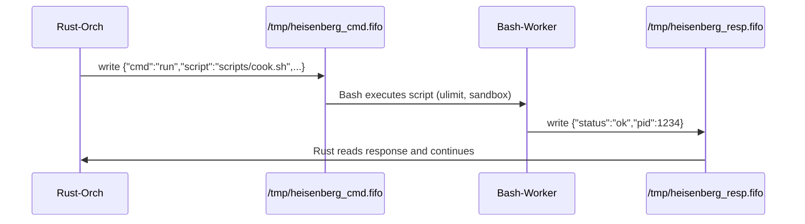

# Heisenberg — Local Autonomous AI Companion

[](https://github.com/at264939-ctrl/Heisenberg) [](LICENSE)

**Runs GGUF 9B-class models locally within a 3 GB RAM budget using adaptive TurboQuant strategies**

Heisenberg is a production-oriented, fully local autonomous agent designed for constrained hardware (Linux and macOS). It combines a high-performance Rust core for reasoning, orchestration, and memory control with a Bash-first operational layer for system integration and auditable execution.

Key design goals:

- Local-only inference with GGUF models (no cloud).
- Strict memory budget (3 GB hard cap) with graceful degradation.
- Bash as a first-class runtime for system integration and sandboxed execution.
- Extensible orchestration for code editing, file ops, browser automation (sandboxed), and long-term memory.

---

## Quick Navigation

- Repository: https://github.com/at264939-ctrl/Heisenberg
- Models: Put `.gguf` files in the `models/` folder.
- Build: `./scripts/build.sh`
- Run: `Heisenberg` or `./scripts/say-my-name.sh`

---

## Visual Architecture (Mermaid)

```mermaid
flowchart LR
  A[User Terminal] --> B[Heisenberg Rust Orchestrator]
  B -->|issues structured JSON| C[Bash Execution Layer]
  C -->|returns JSON| B
  B --> D[The Lab (llama-cpp)]
  D -->|streamed tokens| B
  B --> E[Postgres Memory (Mike long-term)]
  B -.-> F[Blue Sky (patch generator)]
```

Sequence (Rust ↔ Bash IPC):



---

## Project Layout (important paths)

```
Heisenberg/
├── src/
│   ├── heisenberg/   # orchestrator (REPL, action loop)
│   ├── the_lab/       # inference, GGUF loader, llama-cpp integration
│   ├── jesse/         # Bash executor (shell sandbox)
│   ├── gus/           # scheduler
│   ├── mike/          # memory manager + db glue
│   ├── saul/          # config & CLI
│   ├── hank/          # screen observer
│   ├── the_rv/        # browser sandbox
│   └── blue_sky/      # self-modification helpers
├── scripts/
│   ├── build.sh
│   ├── say-my-name.sh
│   ├── cook.sh
│   └── drive.sh
├── models/            # place .gguf files here (do not commit large files)
├── sql/               # memory schema (Postgres)
└── Cargo.toml
```

---

## Installation & Quick Start

1. Ensure Rust toolchain is installed (Rust 1.70+ recommended) and `cargo` available.
2. Place at least one `.gguf` model under `models/` (use Git LFS for large models if you intend to track them).
3. Build and install locally:

```bash
./scripts/build.sh
```

4. Launch the agent (shell UI):

```bash
Heisenberg
# or
./scripts/say-my-name.sh chat
```

5. Example: get memory status (from the CLI):

```bash
Heisenberg status
```

---

## Memory & Resource Strategy (Mike)

- Heisenberg enforces a 3 GB hard memory cap via monitoring (`sysinfo`) and system-level controls. When pressure is detected the orchestrator takes progressive actions:
  1. Shrink inference context / reduce KV cache.
  2. Lower concurrency (single-threaded fallback for heavy ops).
  3. Persist and compact long-term memory to PostgreSQL.
  4. Drop nonessential buffers and disable expensive observers.

Design emphasis: stay responsive under pressure rather than crash.

---

## Security & Privacy

- All operations are local by default. No external APIs or telemetry are enabled.
- Bash scripts are treated as first-class, auditable components; review `scripts/` before granting them execution.
- Browser automation is allow-listed via `scripts/drive.sh` by default.

---

## Extensibility

- Add new inference adaptors in `src/the_lab/` (preferred: FFI to llama-cpp; fallback: isolated subprocess).
- Add new shell actions in `src/jesse/` and expose them via the IPC FIFO for auditable execution.

---

## Support me ☕

If you find this project helpful and would like to support its development, you can buy me a coffee via PayPal. Your support is greatly appreciated!

[](https://www.paypal.com/ncp/payment/FYTDX2XYNGAJ8)

---

## Contact

- Email: ibrahimtarek1245@gmail.com
- Phone / WhatsApp: +201030553763

Repository: https://github.com/at264939-ctrl/Heisenberg

---

## License

This project is released under the MIT License.

---

If you'd like diagrams exported as SVG assets or translations into other languages, I can generate and include them in `docs/`.

---

## Model Spotlight — Qwen3.5-9B-Uncensored-HauhauCS-Aggressive-Q4_K_M.gguf

The primary test model referenced in this repository is:

- `models/Qwen3.5-9B-Uncensored-HauhauCS-Aggressive-Q4_K_M.gguf`

This section explains, in technical detail, how TurboQuant is applied in Heisenberg to enable running this 9B-class GGUF model within a 3 GB RAM constraint.

### Technical summary

- The model is a 9 billion parameter GGUF file with Q4_K_M quantized weights. Even with weight quantization, the KV cache (key/value cache used during generation) and other runtime buffers can exceed available RAM unless actively managed.
- Heisenberg implements an adaptive runtime called the TurboQuant Planner that analyzes model metadata, estimates working set requirements, and chooses runtime trade-offs (KV quantization level, context window size, concurrency limits) to remain within the configured hard memory cap.

### TurboQuant placement in the pipeline

1. GGUF header scan — `the_lab` inspects the model to extract architecture data: number of layers, hidden dimension, number of heads, and tokenizer information.
2. Memory planning — the planner computes the expected KV cache size for a candidate context window and aggregates estimated sizes for mapped weights, tokenizer buffers, and OS overhead.
3. Quantization selection — given the memory budget, the planner selects the strongest acceptable KV quantization (e.g., prefer Q8_0 → Q5_0 → Q4_0) and, when necessary, reduces the context window.
4. Confined runtime — inference is executed via a controlled subprocess (recommended: llama-cpp CLI or `llama-server`) launched under `scripts/cook.sh` which applies `ulimit`-based virtual memory limits and logs resource usage.
5. Live adaptation — `mike` monitors RSS and triggers runtime mitigation (shrink context, reduce concurrency, or cancel nonessential tasks) when pressure approaches the hard cap.

### Practical runtime example for Qwen3.5-9B

1. Client requests generation with `context=2048`.
2. `the_lab` computes KV cache estimate (function of layers, heads, and context length).
3. Memory planner aggregates estimates and predicts total usage.
4. Predicted usage > 3GB → planner selects stronger KV quantization (e.g., Q5_0 or Q4_0) and/or reduces context to 1024.
5. Orchestrator launches `cook.sh --mem-mb 3072 -- llama-server --model models/Qwen3.5-9B-...gguf --prompt "..."`.
6. The process runs confined; `mike` enforces monitoring and can instruct the orchestrator to adjust parameters mid-run if required.

### Why TurboQuant matters (concise)

- TurboQuant emphasizes adaptive KV cache quantization and runtime planning rather than only weight quantization. This enables larger models to operate on machines with limited RAM by reducing the working set and avoiding duplicated weight copies.
- The planner chooses the minimal acceptable quality for KV caching and dynamically balances latency vs memory footprint.

---
---

## Model Spotlight — Qwen3.5-9B-Uncensored-HauhauCS-Aggressive-Q4_K_M.gguf

The primary test model shipped with this workspace (place it in `models/`) is:

- `models/Qwen3.5-9B-Uncensored-HauhauCS-Aggressive-Q4_K_M.gguf`

This README emphasizes how TurboQuant is applied when loading and running this model on low-RAM machines.

### Why this matters

- The model is a 9B-class GGUF file quantized to `Q4_K_M` weights but still requires careful KV cache and runtime planning to stay below the 3 GB RAM cap.
- TurboQuant is the set of runtime strategies used across `src/the_lab/` and the orchestrator to make this practical.

### Where TurboQuant runs in the system

- GGUF scanning: `the_lab` reads the model header to extract layer count, hidden-size, number of heads, and tokenizer metadata.
- Memory Planner: a small planner computes KV cache size for a requested context window and the estimated working set (weights mmap + tokenizer buffers + OS overhead).
- Quantizer/Selector: the planner picks the smallest safe KV quantization (e.g., prefer Q8_0 -> Q5_0 -> Q4_0 settings for the KV cache) and may reduce context window if needed.
- Runtime behavior: inference runs via a streaming subprocess (llama-cpp CLI or `llama-server`) launched within the `scripts/cook.sh` wrapper to enforce ulimit virtual memory caps. This keeps the process confined and auditable.

### Practical example (how it is applied to Qwen3.5-9B...)

1. Orchestrator requests an inference with `context=2048`.
2. `the_lab` scans `Qwen3.5-9B-...gguf` and computes KV cache ≈ X MB (based on layers, heads).
3. Memory planner compares KV cache + mapped weights + baseline overhead vs 3 GB cap.
4. If predicted usage > cap, planner selects a stronger KV quantization (reduce to Q5_0 or Q4_0) and/or trims context to 1024 or 512.
5. `scripts/cook.sh --mem-mb 3072 -- llama-server --model models/Qwen3.5-9B-...gguf --prompt "..."`
  - `cook.sh` sets `ulimit -v` to the configured cap so the OS will prevent runaway allocation.
6. While running, `mike` monitors RSS; if pressure rises it instructs the orchestrator to shrink context or cancel nonessential tasks.

### Why TurboQuant vs naive quant

- TurboQuant is not only about storing weights in Q4 — it focuses on adaptive KV cache quantization and runtime resource planning so large models behave like small models in practice.
- The system avoids duplicating weights in memory (use mmap when possible) and streams tokens rather than buffering entire responses.

---

## شرح مبسّط بالعربية (مهمّة التركيز على TurboQuant)

نقطة القوة في المشروع هي قدرة `TurboQuant Planner` على جعل موديل بحجم 9B قابلًا للتشغيل محليًا على جهاز ذا ذاكرة محدودة (3 جيجابايت). الفكرة الأساسية:

- نفكّر باستمرار بالـ KV cache (الذي يكبر مع طول السياق) ونقيسه مقابل ذاكرة النظام.
- نقوم بمسح رأس ملف الـ GGUF لاستخراج مواصفات النموذج وتحليل حجم الـ KV cache المطلوب.
- إذا تجاوزت التوقعات السقف (3GB)، نقوم تلقائيًا بتقليل جودة KV cache (اختيار إعدادات كمية أقوى) أو تقليل نافذة السياق.
- كل استدعاء inference يُشغّل داخل غلاف (wrapper) بشل آمن (`scripts/cook.sh`) مع حد ذاكرة افتراضي لتجنب انهيار النظام.

النتيجة: يمكنك تشغيل `Qwen3.5-9B-Uncensored-...-Q4_K_M.gguf` على أجهزة محدودة الموارد، مع أداء متدرج وخيار تقليل الدقة أو السياق للحفاظ على الاستجابة.

---

